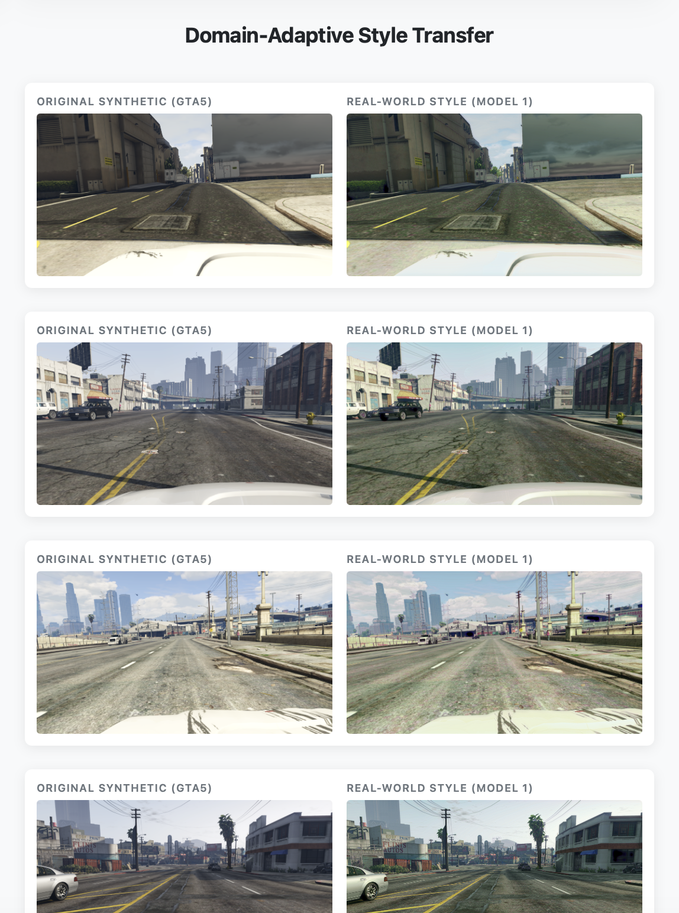
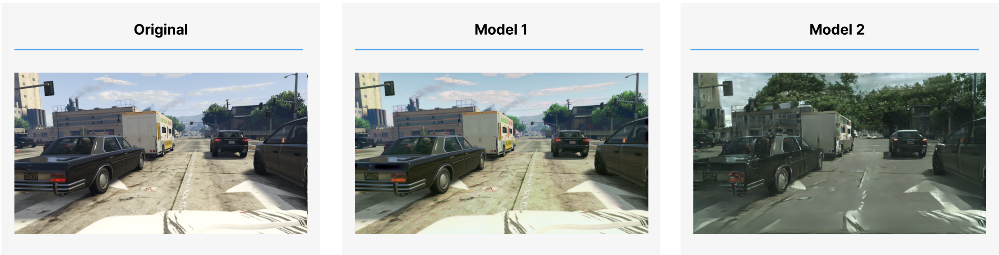
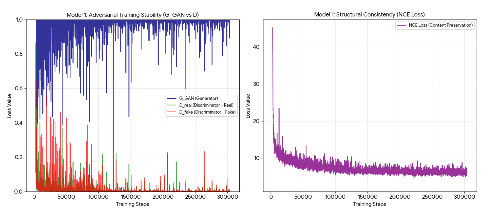
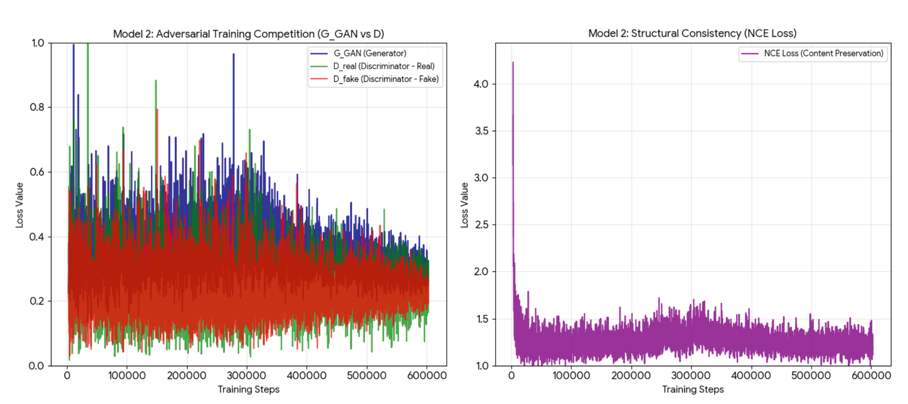
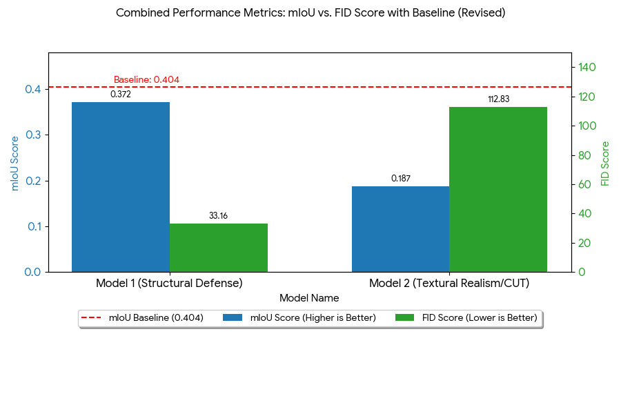

# Domain-Adaptive Style Transfer & Deployment (2025–Ongoing)

**Course:** AI Applications and Lab (Ranked 2nd Place)  
**Role:** Technical Lead (GAN Training, Inference Testing, Scaling & Deployment Architecture)  
**Tech Stack:** `PyTorch`, `FastAPI`, `GANs (CUT/FastCUT)`, `DeepLabV3+`, `PIL (Lanczos)`  
**Domain:** Unsupervised Domain Adaptation (UDA), Computer Vision, Model Deployment  

---

### Project Overview
Developed to bridge the "Domain Gap" between synthetic simulation data (**GTA5**) and real-world urban environments (**Cityscapes**). The objective was to architect a system that translates synthetic imagery into high-fidelity "real" styles to improve the accuracy of downstream semantic segmentation models. 

This project encompasses the entire development lifecycle: from initial model training and identifying resolution-based degradation to engineering a custom deployment server. The system successfully optimized the trade-off between visual realism ($FID$) and structural integrity ($mIoU$), securing a **2nd place** ranking in final evaluations.

---

### Phase 1: The Course Project (Research & Core Engineering)
**Focus:** Full-Cycle GAN Training & Resolution Scaling  

Implementation focused on managing the complete technical execution of the research phase, including architecture selection, multi-day training cycles, and result generation.

* **End-to-End GAN Training:**
    * **Model 1 (FastCUT):** Utilized a lightweight Contrastive Unpaired Translation architecture to prioritize global color distribution, achieving high structural stability and label alignment. (Selected for final submission).
    * **Model 2 (CUT):** Executed an intensive **48-hour training cycle** to synthesize granular textures (asphalt, foliage, concrete). Managed the full training process and hyperparameter configurations from the ground up.
* **Inference & Evaluation Pipeline:** Authored the scripts for the final test runs, producing high-resolution outputs. Integration of a **DeepLabV3+** backbone verified the translation quality.
* **Resolution Restoration:** Identified a **Receptive Field Mismatch** between the $256 \times 256$ training patches and the $1914 \times 1052$ target resolution. When Model 2's $mIoU$ dropped to **0.187** due to texture interference, a post-processing scaling pipeline was engineered using **Lanczos Resampling** to restore semantic accuracy.

---

### Phase 2: Individual Evolution (Optimization & Deployment)
**Focus:** Full-Stack AI Integration & Local Deployment  

Following the course, the project was independently transitioned from a research-script environment into a functional, live-demonstration suite to showcase practical utility.

* **FastAPI Server Architecture:** Architected a high-performance local deployment server. Authored an asynchronous backend to handle high-resolution image I/O from local storage efficiently.
* **Automated Engineering Pipeline:**
    * **`test.py`**: Engineered to bridge the gap between raw `.pth` weights and final image generation.
    * **`upscale.py`**: Developed as a standalone utility to automate the mathematical normalization of large-scale data batches.
    * **`main.py`**: Designed the server engine to mount static directories and serve the web interface via absolute path mapping.

---

### Engineering Challenge: High-Frequency Texture Interference
The most significant hurdle was the emergence of **"Melting Artifacts"** in Model 2 during high-resolution inference—a mathematical consequence of the discrepancy between the training receptive field and the inference scale. This was addressed through the implementation of a precise **Geometric Correction** step. Utilizing **Lanczos Resampling** rather than standard bilinear interpolation minimized texture loss and successfully "re-aligned" the model's output to the expected semantic grid, serving as the decisive factor in the **2nd Place** ranking.

---

### 🖥️ Live Dashboard Demo
The project includes a **FastAPI-based deployment suite** that allows for real-time visual verification of the style-transfer results.

  
*Figure 1: Side-by-side comparison of Original Synthetic (GTA5) vs. Real-World Style (Model 1).*

---


*Figure 2: Side-by-side comparison of Original (GTA5), Model 1 (FastCUT), and Model 2 (CUT) outputs.*

---

### 🔬 Technical Deep Dive: Training & Loss Analysis
To document the underlying optimization process, the following data highlights the adversarial competition and structural consistency measures ($NCE$ Loss) used for each model.

<details>
<summary><b>Click to view Model 1 Metrics (FastCUT)</b></summary>

**Model 1** utilized a unified training approach. The following visualization includes both the Adversarial Training dynamics (Generator vs. Discriminator) and the NCE Loss, confirming the structural stability that led to its selection.

</details>

<details>
<summary><b>Click to view Model 2 Metrics (CUT)</b></summary>

**Model 2** focused on high-fidelity texture synthesis, requiring separate analysis of adversarial stability and structural loss.


</details>

#### **Final Performance Matrix**
The final architecture selection was based on the trade-off between semantic preservation ($mIoU$) and stylistic realism ($FID$).


---

### 🔒 Academic Integrity Note
To comply with university academic integrity policies, this documentation focuses on research methodology and software architecture. Specific training weights and proprietary datasets have been omitted. This repository serves as a professional showcase of engineering proficiency for active university coursework at **KOREATECH**.

---

### 📂 Project Structure
```text
.
├── deployment/
│   ├── main.py              # FastAPI server engine
│   └── templates/           # Jinja2 HTML templates
├── demo_data/               # Showcase folder (Mounted for web demo)
│   ├── original/            # Source synthetic images
│   └── results/             # High-fidelity output images (Model 1)
├── core/
│   ├── test.py              # GAN inference & result generation
│   └── upscale.py           # Lanczos resampling logic
├── research_artifacts/      # Evaluation metrics, G vs D graphs, and UI previews
└── requirements.txt         # Environment dependencies