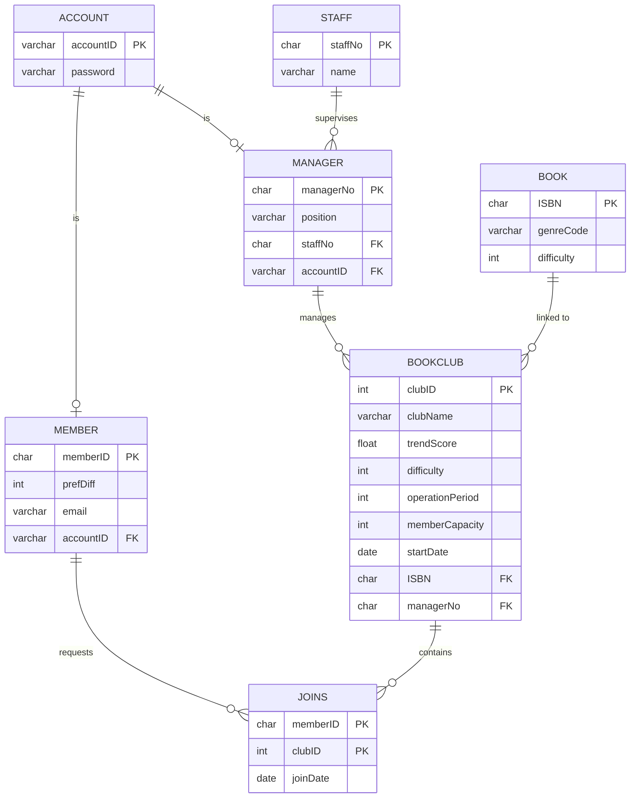

# Kyo-Board: Integrated Book Club System (2026)

**Course:** Database Design  
**Collaboration:** Team Project  
**Tech Stack:** `SQL`, `Microsoft SQL Server`  
**Domain:** Social Community Systems, Database Design, E-commerce Integration  

---

### Project Overview
Kyo-Board is a social community system designed as an extension of the Kyobo Book Centre platform. While Kyobo Book Centre provides a comprehensive e-commerce environment for discovering and purchasing books, Kyo-Board bridges social engagement with the massive pre-existing book database. The system introduces an integrated Book Club environment where users can create and participate in book-centered communities, share posts and notes, and interact through persistent, asynchronous discussions.

---

### System Architecture & Logic
*   **Asynchronous Community Modeling:** Designed a threaded, asynchronous community structure for book-centered discussions. The model supports persistent posts, shared notes, and club memberships rather than real-time messaging.
*   **User View & Access Management:** Defined data visibility and CRUD permissions across four distinct user tiers: System Administrator, Board Manager, Registered Member, and Guest.
*   **Relational Integrity:** Applied strict primary keys, foreign keys, relationship constraints, and normalization principles to maintain total data consistency across the database.

### Entity-Relationship (ER) Diagram

---

### Normalization & Physical Design
The logical design of the Kyo-Board system was subjected to a rigorous data normalization process to eliminate structural redundancy and prevent insertion, deletion, and update anomalies.

*   **Third Normal Form (3NF) Compliance:** All relations satisfy 3NF. For example, a book's reading difficulty is hosted exclusively in the `Book` catalog relation to avoid transitive functional dependencies inside the `Bookclub` relation.
*   **Table Destruction Hierarchy:** To prevent physical DDL validation failures caused by active Foreign Key constraints, a strict reverse-dependency execution sequence is enforced:
    1. **Child Tables:** `Recommendation`, `Post`, `Joins`
    2. **Dependent Tables:** `Bookclub`
    3. **Core Parent Entities:** `Member`, `Manager`
    4. **Root Superclass:** `Staff`, `Account`, `Book`, `System`
