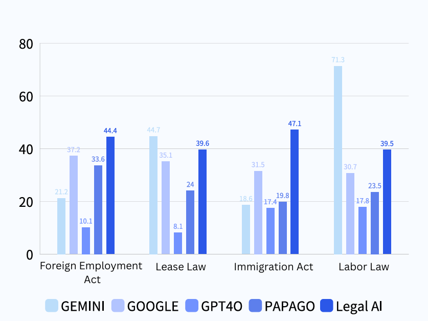
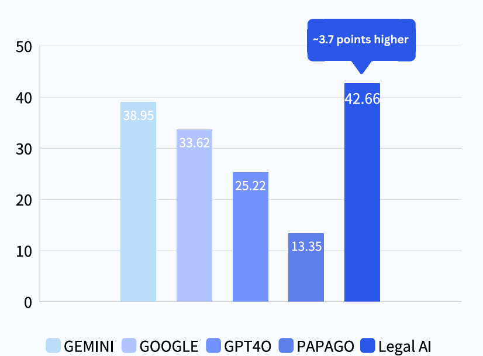
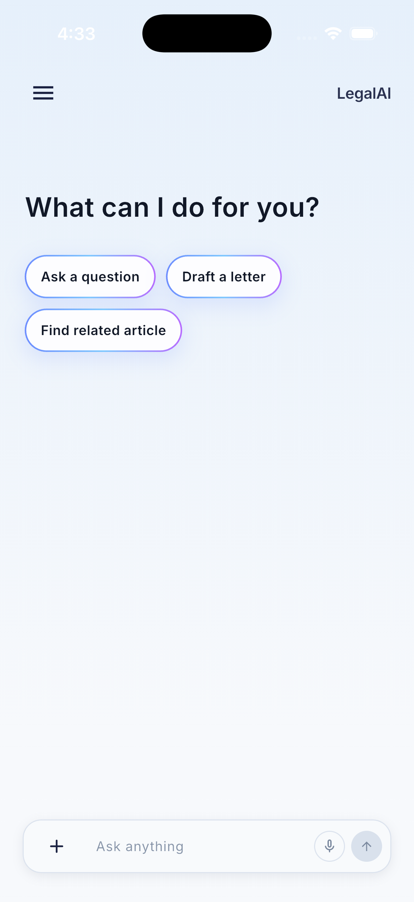
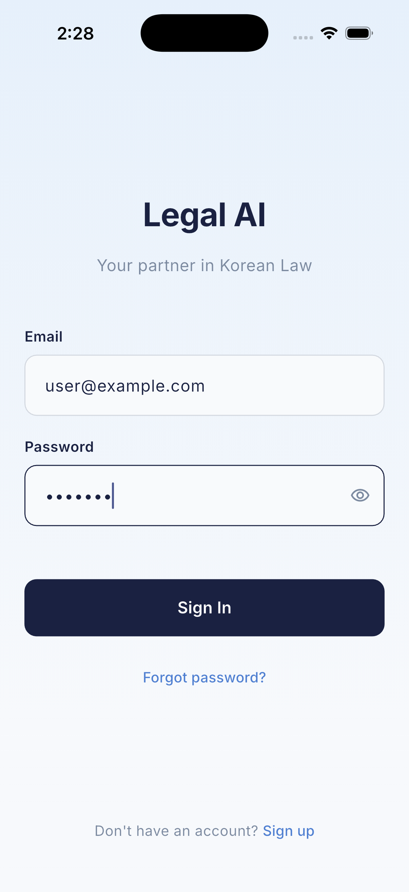
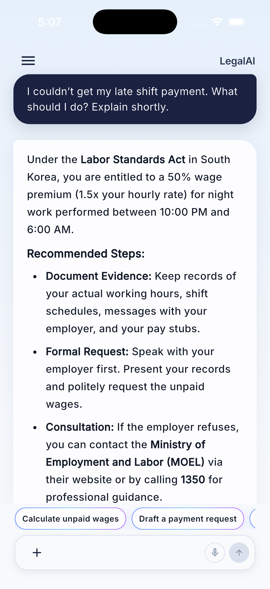
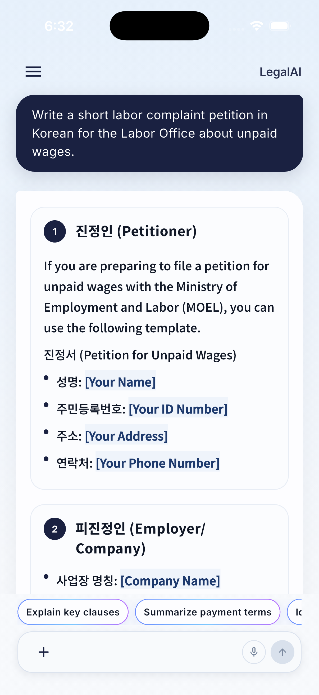
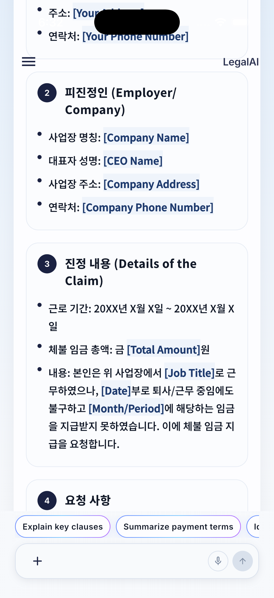
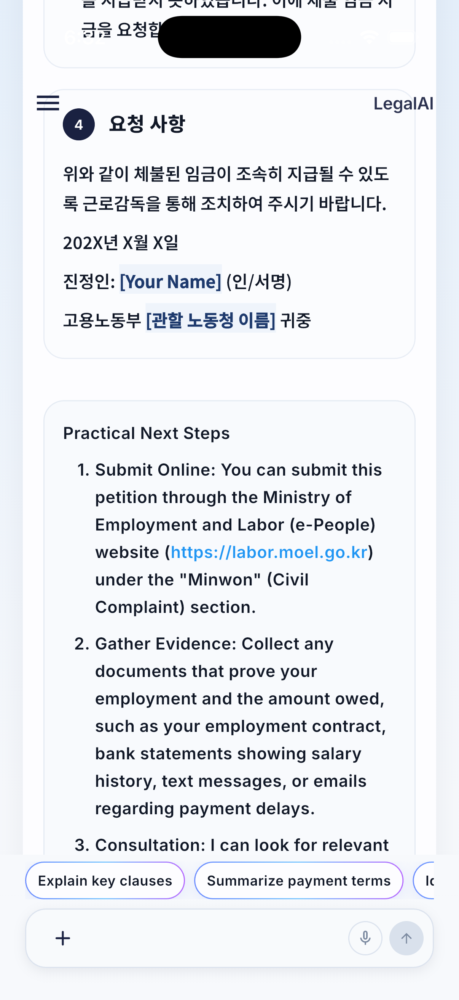
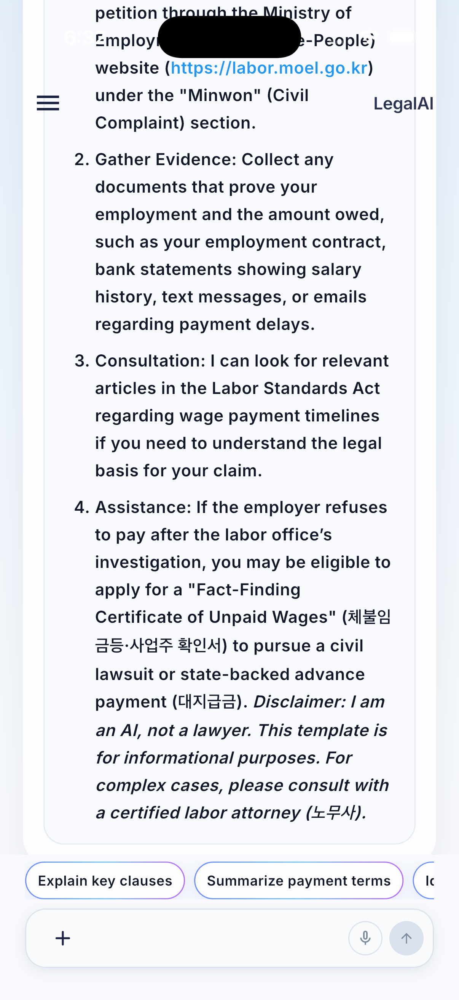

# LegalAI: RAG Based Legal AI Agent System
**Graduation Project Capstone | KOREATECH 2025-2026**

**Collaboration:** Team Project  
**Role:** Frontend Development & UI/UX Design, AI Interaction/Backend Integration  
**Tech Stack:** `Flutter`, `Dart`, `Llama 3 8B`, `QLoRA`, `RAG`, `LangGraph`, `Gemini API`, `FastAPI`, `ChromaDB`  
**Domain:** Natural Language Processing (NLP), Human-Computer Interaction (HCI), Legal AI, Applied AI

---

### Project Overview
LegalAI is a legal consultation Agent designed to improve legal information accessibility for foreign residents in South Korea. By combining a **QLoRA-fine-tuned Llama-3 8B model**, **Retrieval-Augmented Generation (RAG)**, and a **LangGraph-based orchestration system**, LegalAI provides legal consultation grounded in Korean laws and related legal resources.
Rather than functioning as a simple translation tool, the system integrates **legal consultation, document analysis, petition drafting, legal information retrieval, and voice interaction** into a unified service. The system also provides **Plain English explanations** to make complex legal information easier for non-native users to understand.

---

## 2025: Engineering Design Phase (공학설계)
*Focus: Problem Definition, Comparative Research, Requirement Analysis, and System Design*

The initial phase focused on identifying the failures of current translation technologies in the legal domain and defining a technical architecture to solve them.

* **Comparative App Evaluation**: Conducted a deep-dive analysis of existing translation platforms to identify specific failure points and inaccuracies when handling complex Korean legal terminology.
* **Strategic Vision**: Defined the social impact and expected outcomes of the system, focusing on bridging the legal information gap for the non-native population in Korea.
* **Academic Validation**: Presented the conceptual framework and system requirements via a final poster presentation, which was evaluated and graded by a panel of four professors.
* **Evaluation Framework**: Established the use of quantitative metrics, including **COMET**, **BERTScore**, and **BLEU**, to validate translation accuracy against official government records.**

---

## 2026: Implementation Phase (Senior Project/졸업설계)
*Focus: Full-Stack Development, AI Model Fine-Tuning, Agent Architecture, System Integration, and Performance Evaluation*

The implementation phase transformed the system designed during the engineering-design phase into a functional **RAG-based legal AI Agent**. As a team we developed the AI model, retrieval system, Agent orchestration layer, backend infrastructure, frontend application, and multimodal features as an integrated system. The final application supports legal consultation, translation, document analysis, petition drafting, voice interaction, and simplified legal explanations.

### **AI Model & RAG Development**
* **Legal Dataset Construction**: Collected and processed **AI-Hub legal translation data** and **Korea Legislation Research Institute (KLRI) English legal statutes** for model fine-tuning and the legal RAG pipeline, while incorporating **KLIC standard terminology** into the legal-domain Knowledge Adapter.  
* **Llama-3 Fine-Tuning**: Used **Llama-3 8B Instruct** as the base model and applied **4-bit quantization** and **QLoRA** to develop a lightweight legal-domain Knowledge Adapter specialized in Korean legal terminology and legal writing patterns.
* **Legal RAG Pipeline**: Built a **ChromaDB-based vector database** using KLRI legal data to provide the system with access to relevant legal information during response generation.
* **Grounded Responses**: Combined the fine-tuned model with RAG to reduce hallucination and improve the accuracy and reliability of legal terminology and information.
* **Translation System**: Developed a specialized Korean-English legal translation pipeline capable of producing legally contextualized English translations rather than relying solely on general-purpose translation models.

### **AI Agent & System Architecture**
* **LangGraph Orchestration**: Built a **LangGraph-based Agent orchestration layer** using **Gemini 3.1 Flash Lite** to analyze user input and determine the appropriate response flow and tool to invoke.
* **Intent & Context Classification**: Designed the Agent to distinguish between different types of requests and route them to the appropriate system functionality, including legal consultation, legal document analysis, and document generation.
* **Tool-Based Architecture**: Integrated the **Legal RAG Pipeline, Vision OCR Module, and Template Storage** into the Agent workflow so that different tools could be dynamically selected according to the user's request.
* **Conversation State Management**: Implemented **MemorySaver-based state management** to maintain conversational context across multiple interactions and support continuous legal consultation.
* **Response Generation**: Combined retrieved legal information, model-generated responses, and specialized response logic to produce structured legal responses and translations.

### **Frontend Development & UI/UX**
* **Cross-Platform Application**: Developed the user-facing application using **Flutter and Dart**, implementing the primary screens and interaction flows.
* **UI/UX Design**: Designed the application's visual system and interaction patterns to make complex legal information understandable and accessible to foreign residents.
* **Core Interface**:
    * Developed the **AI legal consultation interface** and conversation flow.
    * Implemented interfaces for **legal translation and retrieved legal information**.
    * Developed UI flows for **legal document analysis** and **petition drafting**.
* **AI Response Presentation**: Designed how different types of AI-generated results should be visually presented depending on the user's request, including structured responses, translated content, document-analysis results, and generated documents.
* **Feature Interaction Design**: Defined the interaction flow between the user and individual AI capabilities, including how users initiate features, how results are displayed, and what follow-up actions are available.
* **Template-Based Presentation**: Implemented structured templates and presentation logic to ensure that AI-generated content is displayed consistently and clearly across different features.

### **Multimodal & Accessibility Features**
* **Vision OCR**: Integrated a Vision OCR module capable of extracting text from image-based legal documents such as employment contracts and wage statements for subsequent analysis.
* **Document Analysis**: Developed the workflow for identifying and analyzing potentially problematic clauses in uploaded legal documents.
* **Speech-to-Text**: Integrated **Google Cloud Speech-to-Text (STT)** to convert spoken user questions into text for legal consultation.
* **Text-to-Speech**: Integrated **ElevenLabs Multilingual v3** to provide natural voice responses to users.
* **Voice Consultation**: Connected STT and TTS with the Agent workflow to support voice-based legal consultation.
* **Plain English**: Implemented a **Plain English transformation strategy** to convert complex legal explanations into clearer and more accessible language.
* **Contextual Suggestions**: Added dynamically generated follow-up suggestions, such as requests to summarize a legal response in Plain English, to help users continue their interaction with the system.

### **Petition Drafting & Legal Document Features**
* **Petition Drafting**: Implemented a document-generation workflow that assists users in creating legal petitions based on their requests and relevant information.
* **Document Templates**: Utilized template-based structures to organize generated legal documents into consistent formats.
* **Legal Document Workflow**: Connected document input, AI processing, legal information retrieval, and structured output into a unified workflow.

### **Quantitative Performance Evaluation**
* **Evaluation Dataset**: Used a separately maintained evaluation dataset to measure the translation performance of the developed system.
* **Benchmark Models**: Compared LegalAI against **Gemini, Google Translate, GPT-4o, and Papago** across multiple legal categories.
* **Evaluation Metric**: Used **BLEU Score** as the primary quantitative metric for translation quality.
* **Legal Categories**: Evaluated translation performance using legal texts related to **foreign employment, housing leases, immigration, and labor standards**.
* **Evaluation Results**:
    * **Overall Average BLEU Score:** 42.66
    * **Immigration:** 47.1
    * **Foreign Employment:** 44.4
* **Result**: LegalAI achieved the highest overall BLEU Score among the evaluated systems. The results demonstrated that the combination of legal-domain fine-tuning and RAG improved translation performance in the evaluated legal domains.

<b>📊 Click to view BLEU score evaluation</b>

 

  
*Domain-Specific BLEU Comparison*

  
*Overall BLEU Score*

### **Final System**
The completed system was implemented as a **smartphone-optimized legal consultation application** integrating legal translation, consultation, legal information retrieval, document analysis, petition drafting, voice interaction, and Plain English explanations. The final architecture combines the **Flutter frontend, FastAPI backend, LangGraph orchestration, Gemini API, Llama-3 8B, QLoRA Knowledge Adapter, ChromaDB-based RAG pipeline, and multimodal processing modules** into a unified legal AI service.

### **Application Screenshots**

<b>📱 Click to view application screenshots</b>

#### Welcome & Login
 

#### Legal Consultation
 

#### Document Recognition & Analysis
 

#### Petition Drafting
   

